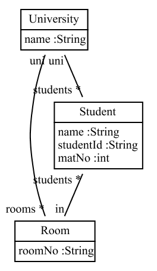
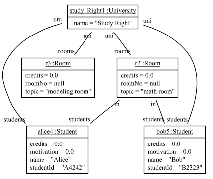

# fulib - Fujaba library

[](https://travis-ci.org/fujaba/fulib)
[](https://bintray.com/fujaba/maven/fulib/_latestVersion "Download")

Fulib is a Java-code generating library.

## Installation

`build.gradle`:

```groovy
repositories {
    mavenCentral()
    // and/or:
    jcenter()
}
```

```groovy
dependencies {
    // https://mvnrepository.com/artifact/org.fulib/fulibYaml
    compile group: 'org.fulib', name: 'fulib', version: '1.1.0'
}
```

## Usage

First you write code that builds up your class model:

<!-- insert_code_fragment: test4FulibReadme.classmodel -->
      ClassModelBuilder mb = Fulib.classModelBuilder("de.uniks.studyright");

      ClassBuilder university = mb.buildClass("University")
            .buildAttribute("name", mb.STRING);

      ClassBuilder student = mb.buildClass("Student")
            .buildAttribute("name", mb.STRING)
            .buildAttribute("studentId", mb.STRING)
            .buildAttribute("credits", mb.DOUBLE)
            .buildAttribute("motivation", mb.DOUBLE);

      ;

      ClassBuilder room = mb.buildClass("Room")
            .buildAttribute("roomNo", mb.STRING)
            .buildAttribute("topic", mb.STRING)
            .buildAttribute("credits", mb.DOUBLE);

      university.buildAssociation(student, "students", mb.MANY, "uni", mb.ONE);
      university.buildAssociation(room, "rooms", mb.MANY, "uni", mb.ONE);
      room.buildAssociation(student, "students", mb.MANY, "in", mb.ONE);


      ClassModel model = mb.getClassModel();
<!-- end_code_fragment: -->

Rendered as a class diagram this model looks like:



From the class model you may generate Java code that implements the modeled classes:

<!-- insert_code_fragment: test4FulibReadme.generate -->
      Fulib.generator().generate(model);
<!-- end_code_fragment: -->

Once your IDE has compiled the generated code, you may use it like:

<!-- insert_code_fragment: StudyRightUserStories.testSimpleObjectModel -->
      University studyRight = new University().setName("Study Right");

      Room mathRoom = new Room().setTopic("math room");
      studyRight.withRooms(mathRoom);
      Room modelingRoom = new Room().setTopic("modeling room").setUni(studyRight);
      Student alice = new Student().setName("Alice").setStudentId("A4242").setIn(mathRoom);
      Student   bob = new Student().setName("Bob")  .setStudentId("B2323").setIn(mathRoom);
      studyRight.withStudents(alice, bob);
<!-- end_code_fragment: -->

This application code creates the object structure shown in the object diagram shown below.

To create an object diagram from your object structure use:


<!-- insert_code_fragment: StudyRightUserStories.FulibTools.objectDiagrams -->
      FulibTools.objectDiagrams().dumpPng("../fulib/doc/images/studyRightObjects.png", studyRight);
<!-- end_code_fragment: -->



For more details on class models and code generation see: [Fulib Class Models](doc/FulibClassModels.md)

Fulib also provides means for model queries and model transformations, see:
[Fulib Tables](doc/FulibTables.md)
