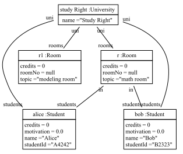

# fulib - Fujaba library

[](https://travis-ci.org/fujaba/fulib)
[](https://github.com/fujaba/fulib/actions)
[](https://bintray.com/fujaba/maven/fulib/_latestVersion "Download")

Fulib is a library that provides code generation for UML like models and some model management functionalities.
Using a domain-specific language provided by Java APIs, it allows you to define classes, attributes and associations with a meta model.
From the meta model definition, Fulib can automatically generate Java code.
The generated code ensures referential integrity and can optionally include support for property change listeners or JavaFX.

Fulib-generated Java files can seamlessly coexist with hand-written code and may even be modified.
Great care is taken that no hand-written code is deleted or changed by code generation.
Fulib is able to read and modify any Java code using language features from up to Java 11,
even if it contains syntax errors or can otherwise not be compiled.

We have an Online Version at www.fulib.org where you can find docs and tutorials for getting started.

## Installation

`build.gradle`:

```groovy
plugins {
    id 'org.fulib.fulibGradle' version '0.4.0'
}

repositories {
    mavenCentral()
    jcenter()
}

dependencies {
    // https://mvnrepository.com/artifact/org.fulib/fulibScenarios
    fulibScenarios group: 'org.fulib', name: 'fulibScenarios', version: '1.3.0'
}
```

## Usage

### Defining the Class Model

In the following tutorial, we build a class model for a university.
It uses the package name `de.uniks.studyright`, which you can replace according to your needs.

Create a class `GenModel` in the `de.uniks.studyright` package and **put it in the `src/gen/java` source directory**.
The name `GenModel` is only a convention, you can also use a different one.

<!-- insert_code_fragment: test.GenModel | fenced -->
```java
package de.uniks.studyright;

import org.fulib.builder.ClassModelDecorator;
import org.fulib.builder.ClassModelManager;
import org.fulib.builder.Type;
import org.fulib.classmodel.Clazz;

public class GenModel implements ClassModelDecorator
{
   @Override
   public void decorate(ClassModelManager mm)
   {
      final Clazz university = mm.haveClass("University", c -> {
         c.attribute("name", Type.STRING);
      });

      final Clazz student = mm.haveClass("Student", c -> {
         c.attribute("name", Type.STRING);
         c.attribute("studentId", Type.STRING);
         c.attribute("credits", Type.INT);
         c.attribute("motivation", Type.DOUBLE);
      });

      final Clazz room = mm.haveClass("Room", c -> {
         c.attribute("roomNo", Type.STRING);
         c.attribute("topic", Type.STRING);
         c.attribute("credits", Type.INT);
      });

      // a university has many students, students have one uni
      mm.associate(university, "students", Type.MANY, student, "uni", Type.ONE);

      // a university has many rooms, a room has one uni
      mm.associate(university, "rooms", Type.MANY, room, "uni", Type.ONE);

      // a room has many students, a student is in one room
      mm.associate(room, "students", Type.MANY, student, "in", Type.ONE);
   }
}
```
<!-- end_code_fragment: -->

### Generating Java Code

Now, run `gradle generateScenarioSource`.
This will run the code you put in the `GenModel.decorate` method and generate all classes you described.
You can check out the results in the `de.uniks.studyright` package in the `src/main/java` source directory.

Rendered as a class diagram this model looks like this:


### Using Generated Code

Now you can use the generated classes from your code (in `src/main/java` and `src/test/java`).
Here's an example for our university model:

<!-- insert_code_fragment: test.UniversityModelUsage | fenced -->
```java
University studyRight = new University().setName("Study Right");

Room mathRoom = new Room().setTopic("math room");
studyRight.withRooms(mathRoom);
Room modelingRoom = new Room().setTopic("modeling room").setUni(studyRight);
Student alice = new Student().setName("Alice").setStudentId("A4242").setIn(mathRoom);
Student bob = new Student().setName("Bob").setStudentId("B2323").setIn(mathRoom);
studyRight.withStudents(alice, bob);
```
<!-- end_code_fragment: -->

### Object Diagrams

The code using the model creates the object structure shown in the object diagram below.



To create an object diagram from your object structure, add this line:

<!-- insert_code_fragment: test.UniversityObjectDiagram | fenced -->
```java
FulibTools.objectDiagrams().dumpPng("doc/images/studyRightObjects.png", studyRight);
```
<!-- end_code_fragment: -->

This requires adding [fulibTools](https://github.com/fujaba/fulibTools) as a dependency.

---

Fulib also provides means for model queries and model transformations, see:
[Fulib Tables](doc/FulibTables.md)

## History

Fulib is the newest tool of the Fujaba Family https://github.com/fujaba .

| Period | Activity |
| --- | --- |
| 1998 - 2008 | We developed the Fujaba (From UML to Java And Back Again) tool as a graphical editor for class diagrams and model transformations. |
| 2008 - 2018 | We moved on to [SDMLib](https://github.com/fujaba/SDMLib) (Story Driven Modeling Library). SDMLib got rid of the graphical editors. |
| 2019 - present | We did a major refactoring of the SDMLib and call it Fulib (Fujaba Library) now. |

## Contributing

See [CONTRIBUTING.md](CONTRIBUTING.md).

## License

[MIT](LICENSE.md)
