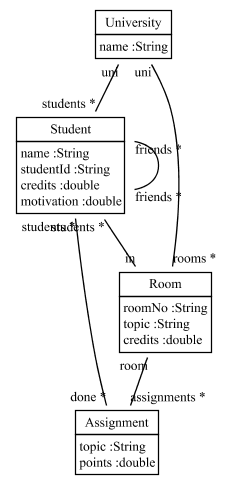
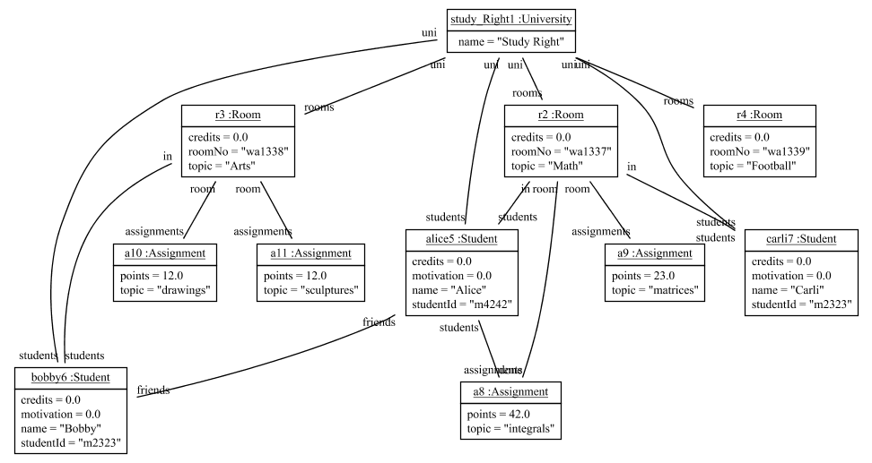
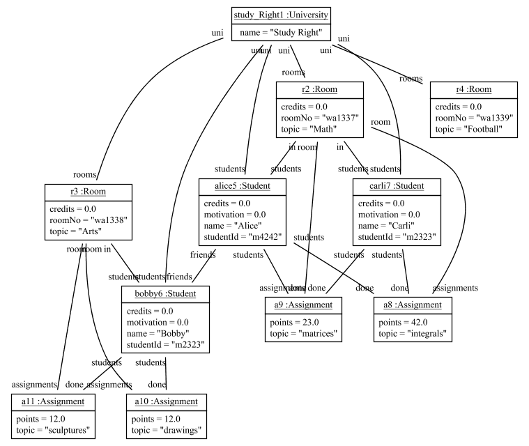
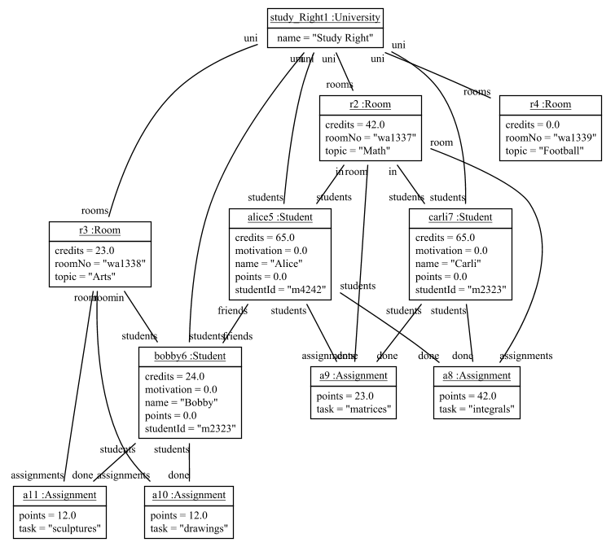

# Fulib Simple Tables

Fulib Simple Tables are the model query and transformation mechanisms
provided by Fulib.

To demonstrate Fulib Simple Tables we start with an extended version
of the StudyRight University class model:

<!-- insert_code_fragment: test4FulibReadme.classmodel -->
      ClassModelBuilder mb = Fulib.classModelBuilder("de.uniks.studyright");

      ClassBuilder university = mb.buildClass("University")
            .buildAttribute("name", mb.STRING);

      ClassBuilder student = mb.buildClass("Student")
            .buildAttribute("name", mb.STRING)
            .buildAttribute("studentId", mb.STRING)
            .buildAttribute("credits", mb.DOUBLE)
            .buildAttribute("motivation", mb.DOUBLE);

      ;

      ClassBuilder room = mb.buildClass("Room")
            .buildAttribute("roomNo", mb.STRING)
            .buildAttribute("topic", mb.STRING)
            .buildAttribute("credits", mb.DOUBLE);

      university.buildAssociation(student, "students", mb.MANY, "uni", mb.ONE);
      university.buildAssociation(room, "rooms", mb.MANY, "uni", mb.ONE);
      room.buildAssociation(student, "students", mb.MANY, "in", mb.ONE);

      ClassModel model = mb.getClassModel();
<!-- end_code_fragment: -->

<!-- insert_code_fragment: test4FulibReadme.extensions2classmodel -->
      ClassBuilder assignment = mb.buildClass("Assignment")
            .buildAttribute("topic", mb.STRING)
            .buildAttribute("points", mb.DOUBLE);

      room.buildAssociation(assignment, "assignments", mb.MANY, "room", mb.ONE);
      student.buildAssociation(assignment, "done", mb.MANY, "students", mb.MANY);
      student.buildAssociation(student, "friends", mb.MANY, "friends", mb.MANY);
<!-- end_code_fragment: -->

Rendered as a class diagram the extended class model looks like:

Now, we generate the usual model implementation:
<!-- insert_code_fragment: test4FulibReadme.generate -->
      Fulib.generator().generate(model);
<!-- end_code_fragment: -->

Once the generated code is compiled we may construct some objects:

<!-- insert_code_fragment: StudyRightTables.objectModel -->
      // some objects
      University studyRight = new University().setName("Study Right");
      String name = University[].class.getName();
      System.out.println(name);

      Room mathRoom = new Room().setRoomNo("wa1337").setTopic("Math").setUni(studyRight);
      Room artsRoom = new Room().setRoomNo("wa1338").setTopic("Arts").setUni(studyRight);
      Room sportsRoom = new Room().setRoomNo("wa1339").setTopic("Football").setUni(studyRight);

      Assignment integrals = new Assignment().setTopic("integrals").setPoints(42).setRoom(mathRoom);
      Assignment matrix = new Assignment().setTopic("matrices").setPoints(23).setRoom(mathRoom);
      Assignment drawings = new Assignment().setTopic("drawings").setPoints(12).setRoom(artsRoom);
      Assignment sculptures = new Assignment().setTopic("sculptures").setPoints(12).setRoom(artsRoom);

      Student alice = new Student().setStudentId("m4242").setName("Alice").setUni(studyRight).setIn(mathRoom).withDone(integrals);
      Student bob   = new Student().setStudentId("m2323").setName("Bobby"  ).setUni(studyRight).setIn(artsRoom).withFriends(alice);
      Student carli = new Student().setStudentId("m2323").setName("Carli").setUni(studyRight).setIn(mathRoom);
<!-- end_code_fragment: -->

This results in:

Next, we generate table classes:

<!-- insert_code_fragment: test4FulibReadme.tableGenerate -->
      Fulib.tablesGenerator().generate(model);
<!-- end_code_fragment: -->

With the table classes we do some table stuff:

<!-- insert_code_fragment: StudyRightTables.createUniTable1 -->
      UniversityTable uniTable = new UniversityTable(studyRight);
      RoomTable roomsTable = uniTable.expandRooms("Room");
      AssignmentTable assignmentsTable = roomsTable.expandAssignments("Assignment");
<!-- end_code_fragment: -->

The first line generates an "uniTable" with just one "University" column
and with just one row containing the "StudyRight" object.

<!-- insert_code_fragment: StudyRightTables.uniTable1 -->
University 	| 
 --- 	| 
Study Right 	| 
<!-- end_code_fragment: -->

The second line extends the uniTable with a "Room" column.
For each (the single) row of the old table we look up the University u contained
in the University column
(in our case there is just one row containing the studyRight object in its University column).
For each such uni object u, we look up each room r
attached to it. For each uni object u and room r pair, we create a new row
in the resulting "roomsTable" table.

<!-- insert_code_fragment: StudyRightTables.uniTable2 -->
University 	| Room 	| 
 --- 	|  --- 	| 
Study Right 	| wa1337 Math 	| 
Study Right 	| wa1338 Arts 	| 
Study Right 	| wa1339 Football 	| 
<!-- end_code_fragment: -->

The third line expands the roomsTable with the attached assignments.
Again we loop through the rows of the roomsTable and look up the University
u contained in the University column and the room
r contained in the Room column. Then, for each assignment a attached to room r
we create a result row containg u, r, and a.

The table below shows the current result:

<!-- insert_code_fragment: StudyRightTables.uniTable3 -->
University 	| Room 	| Assignment 	| 
 --- 	|  --- 	|  --- 	| 
Study Right 	| wa1337 Math 	| integrals 	| 
Study Right 	| wa1337 Math 	| matrices 	| 
Study Right 	| wa1338 Arts 	| drawings 	| 
Study Right 	| wa1338 Arts 	| sculptures 	| 
<!-- end_code_fragment: -->

Note, all three variables uniTable, roomsTable, and assignmentsTable
refer to the same internal table object. However, they each use a wrapper
that encapsulates the internal table and adds expand methods that
are specific to the corresponding column. For example, the roomsTable
has an expandAssignments method.

Each table wrapper also offers a toSet() method that collects all objects
of the corresponding column. Thus, to sum up the points of all assignments
of our table we may:

<!-- insert_code_fragment: StudyRightTables.loop_through_assignments -->
      // loop through assignments
      double sum = 0;
      for (Assignment a : assignmentsTable.toSet())
      {
         sum += a.getPoints();
      }
      assertThat(sum, equalTo(89.0));
<!-- end_code_fragment: -->

Alternatively, we may expand the assignmentsTable by a "Points" column:

<!-- insert_code_fragment: StudyRightTables.pointsTable -->
      doubleTable pointsTable = assignmentsTable.expandPoints("Points");
      sum = pointsTable.sum();
      assertThat(roomsTable.getTable().size(), equalTo(4));
      assertThat(assignmentsTable.getTable().size(), equalTo(4));
      assertThat(sum, equalTo(89.0));
<!-- end_code_fragment: -->

<!-- insert_code_fragment: StudyRightTables.pointsTableResult -->
University 	| Room 	| Assignment 	| Points 	| 
 --- 	|  --- 	|  --- 	|  --- 	| 
Study Right 	| wa1337 Math 	| integrals 	| 42.0 	| 
Study Right 	| wa1337 Math 	| matrices 	| 23.0 	| 
Study Right 	| wa1338 Arts 	| drawings 	| 12.0 	| 
Study Right 	| wa1338 Arts 	| sculptures 	| 12.0 	| 
<!-- end_code_fragment: -->

The resulting pointsTable has a sum method that sums up all
double values contained in the corresponding column.

To further expand our table we might add students that are in rooms:

<!-- insert_code_fragment: StudyRightTables.studentsTable -->
      StudentTable students = roomsTable.expandStudents("Student");
      assertThat(students.getTable().size(), equalTo(6));
<!-- end_code_fragment: -->

<!-- insert_code_fragment: StudyRightTables.studentsTableResult -->
University 	| Room 	| Assignment 	| Points 	| Student 	| 
 --- 	|  --- 	|  --- 	|  --- 	|  --- 	| 
Study Right 	| wa1337 Math 	| integrals 	| 42.0 	| Alice m4242 	| 
Study Right 	| wa1337 Math 	| integrals 	| 42.0 	| Carli m2323 	| 
Study Right 	| wa1337 Math 	| matrices 	| 23.0 	| Alice m4242 	| 
Study Right 	| wa1337 Math 	| matrices 	| 23.0 	| Carli m2323 	| 
Study Right 	| wa1338 Arts 	| drawings 	| 12.0 	| Bobby m2323 	| 
Study Right 	| wa1338 Arts 	| sculptures 	| 12.0 	| Bobby m2323 	| 
<!-- end_code_fragment: -->

The resulting table has the cross product of assignments and students
for each room.

In addition to the cross product we may select a subset of the
table rows using a filter operation:

<!-- insert_code_fragment: StudyRightTables.filterAssignmentsTable -->
      assignmentsTable.filter( a -> a.getPoints() <= 30);
      assertThat(students.getTable().size(), equalTo(4));
<!-- end_code_fragment: -->

<!-- insert_code_fragment: StudyRightTables.filterAssignmentsTableResult -->
University 	| Room 	| Assignment 	| Points 	| Student 	| 
 --- 	|  --- 	|  --- 	|  --- 	|  --- 	| 
Study Right 	| wa1337 Math 	| matrices 	| 23.0 	| Alice m4242 	| 
Study Right 	| wa1337 Math 	| matrices 	| 23.0 	| Carli m2323 	| 
Study Right 	| wa1338 Arts 	| drawings 	| 12.0 	| Bobby m2323 	| 
Study Right 	| wa1338 Arts 	| sculptures 	| 12.0 	| Bobby m2323 	| 
<!-- end_code_fragment: -->

Alternatively we may filter by rows:

<!-- insert_code_fragment: StudyRightTables.filterRowTable -->
      // filter row
      uniTable = new UniversityTable(studyRight);
      roomsTable = uniTable.expandRooms();
      students = roomsTable.expandStudents("Student");
      assignmentsTable = roomsTable.expandAssignments("Assignment");

      students.filterRow( row ->
      {
         Student studi = (Student) row.get("Student");
         Assignment assignment = (Assignment) row.get("Assignment");
         return studi.getDone().contains(assignment);
      });

      assertThat(students.getTable().size(), equalTo(1));
<!-- end_code_fragment: -->

<!-- insert_code_fragment: StudyRightTables.filterRowTableResult -->
University 	| B 	| Student 	| Assignment 	| 
 --- 	|  --- 	|  --- 	|  --- 	| 
Study Right 	| wa1337 Math 	| Alice m4242 	| integrals 	| 
<!-- end_code_fragment: -->

Note, when we did the filter by assignment, our internal table had
been reduced to 4 rows. To have a full table for the filter by row
operation, we had to reconstruct that full table. Note, on the reconstruction
we did not provide a column name for the expandRooms call. Thus, the column
got the name "B", the default name for the second column.

Above row filter requires that the current student has done the
current assignment. This filter condition may also be expressed by a
hasDone operation:

<!-- insert_code_fragment: StudyRightTables.filterHasDone -->
      // filter row
      uniTable = new UniversityTable(studyRight);
      roomsTable = uniTable.expandRooms();
      students = roomsTable.expandStudents("Student");
      assignmentsTable = roomsTable.expandAssignments("Assignment");
      students.hasDone(assignmentsTable);

      assertThat(students.getTable().size(), equalTo(1));
<!-- end_code_fragment: -->

<!-- insert_code_fragment: StudyRightTables.filterHasDoneResult -->
University 	| B 	| Student 	| Assignment 	| 
 --- 	|  --- 	|  --- 	|  --- 	| 
Study Right 	| wa1337 Math 	| Alice m4242 	| integrals 	| 
<!-- end_code_fragment: -->

Maybe its bad style, but the filter operations may also be used to modify
the current model:

<!-- insert_code_fragment: StudyRightTables.doCurrentAssignments -->
      uniTable = new UniversityTable(studyRight);
      roomsTable = uniTable.expandRooms();
      students = roomsTable.expandStudents("Student");
      assignmentsTable = roomsTable.expandAssignments("Assignment");

      // do current assignments
      students.filterRow( row ->
      {
         Student studi = (Student) row.get("Student");
         Assignment assignment = (Assignment) row.get("Assignment");
         studi.withDone(assignment);
         return true;
      });

      FulibTools.objectDiagrams().dumpPng("../fulib/doc/images/studyRightObjectsMoreDone4Tables.png", studyRight);

      assertThat(alice.getDone().size(), equalTo(2));
      assertThat(integrals.getStudents().contains(alice), is(true));

      // show size of done
      uniTable.addColumn("noOfDone",  row ->
      {
         Student studi = (Student) row.get("Student");
         return studi.getDone().size();
      });

      // show done
      students.expandDone("Done");
<!-- end_code_fragment: -->

<!-- insert_code_fragment: StudyRightTables.doCurrentAssignmentsResult -->
University 	| B 	| Student 	| Assignment 	| noOfDone 	| Done 	| 
 --- 	|  --- 	|  --- 	|  --- 	|  --- 	|  --- 	| 
Study Right 	| wa1337 Math 	| Alice m4242 	| integrals 	| 2 	| integrals 	| 
Study Right 	| wa1337 Math 	| Alice m4242 	| integrals 	| 2 	| matrices 	| 
Study Right 	| wa1337 Math 	| Alice m4242 	| matrices 	| 2 	| integrals 	| 
Study Right 	| wa1337 Math 	| Alice m4242 	| matrices 	| 2 	| matrices 	| 
Study Right 	| wa1337 Math 	| Carli m2323 	| integrals 	| 2 	| integrals 	| 
Study Right 	| wa1337 Math 	| Carli m2323 	| integrals 	| 2 	| matrices 	| 
Study Right 	| wa1337 Math 	| Carli m2323 	| matrices 	| 2 	| integrals 	| 
Study Right 	| wa1337 Math 	| Carli m2323 	| matrices 	| 2 	| matrices 	| 
Study Right 	| wa1338 Arts 	| Bobby m2323 	| drawings 	| 2 	| drawings 	| 
Study Right 	| wa1338 Arts 	| Bobby m2323 	| drawings 	| 2 	| sculptures 	| 
Study Right 	| wa1338 Arts 	| Bobby m2323 	| sculptures 	| 2 	| drawings 	| 
Study Right 	| wa1338 Arts 	| Bobby m2323 	| sculptures 	| 2 	| sculptures 	| 
<!-- end_code_fragment: -->

As the current table contains some confusing cross products let
us drop the Assignment column:

<!-- insert_code_fragment: StudyRightTables.dropColumnsAssignment -->
      uniTable.dropColumns("Assignment");
<!-- end_code_fragment: -->

<!-- insert_code_fragment: StudyRightTables.dropColumnsAssignmentResult -->
University 	| B 	| Student 	| noOfDone 	| Done 	| 
 --- 	|  --- 	|  --- 	|  --- 	|  --- 	| 
Study Right 	| wa1337 Math 	| Alice m4242 	| 2 	| integrals 	| 
Study Right 	| wa1337 Math 	| Alice m4242 	| 2 	| matrices 	| 
Study Right 	| wa1337 Math 	| Carli m2323 	| 2 	| integrals 	| 
Study Right 	| wa1337 Math 	| Carli m2323 	| 2 	| matrices 	| 
Study Right 	| wa1338 Arts 	| Bobby m2323 	| 2 	| drawings 	| 
Study Right 	| wa1338 Arts 	| Bobby m2323 	| 2 	| sculptures 	| 
<!-- end_code_fragment: -->

Alternatively, we may select the columns we are interested in:

<!-- insert_code_fragment: StudyRightTables.selectColumns -->
      students.selectColumns("Student", "Done");
      assertThat(students.getTable().size(), equalTo(6));
<!-- end_code_fragment: -->

<!-- insert_code_fragment: StudyRightTables.selectColumnsResult -->
Student 	| Done 	| 
 --- 	|  --- 	| 
Alice m4242 	| integrals 	| 
Alice m4242 	| matrices 	| 
Carli m2323 	| integrals 	| 
Carli m2323 	| matrices 	| 
Bobby m2323 	| drawings 	| 
Bobby m2323 	| sculptures 	| 
<!-- end_code_fragment: -->

Note, you may use nested tables. This is handy if you
want to update all elements of a certain column.

<!-- insert_code_fragment: StudyRightTables.nestedTables -->
      uniTable = new UniversityTable(studyRight);
      students = uniTable.expandStudents("Students");
      students.addColumn("Credits", row -> {
         Student student = (Student) row.get("Students");
         double pointSum = new StudentTable(student).expandDone().expandPoints().sum();
         student.setCredits(pointSum);
         return pointSum;
      });
      students.addColumn("Done", row -> {
         Student student = (Student) row.get("Students");
         String doneTopics = new StudentTable(student).expandDone().expandTopic().join(", ");
         return doneTopics;
      });
<!-- end_code_fragment: -->

Note, in the third last line operation expandTopic adds a column with
the topic names of the corresponding assignments to the local table.
On string columns one may call join in order to concatenate all
strings.

<!-- insert_code_fragment: StudyRightTables.nestedTablesResult -->
University 	| Students 	| Credits 	| Done 	| 
 --- 	|  --- 	|  --- 	|  --- 	| 
Study Right 	| Alice m4242 	| 65.0 	| integrals, matrices 	| 
Study Right 	| Bobby m2323 	| 24.0 	| drawings, sculptures 	| 
Study Right 	| Carli m2323 	| 65.0 	| integrals, matrices 	| 
<!-- end_code_fragment: -->

